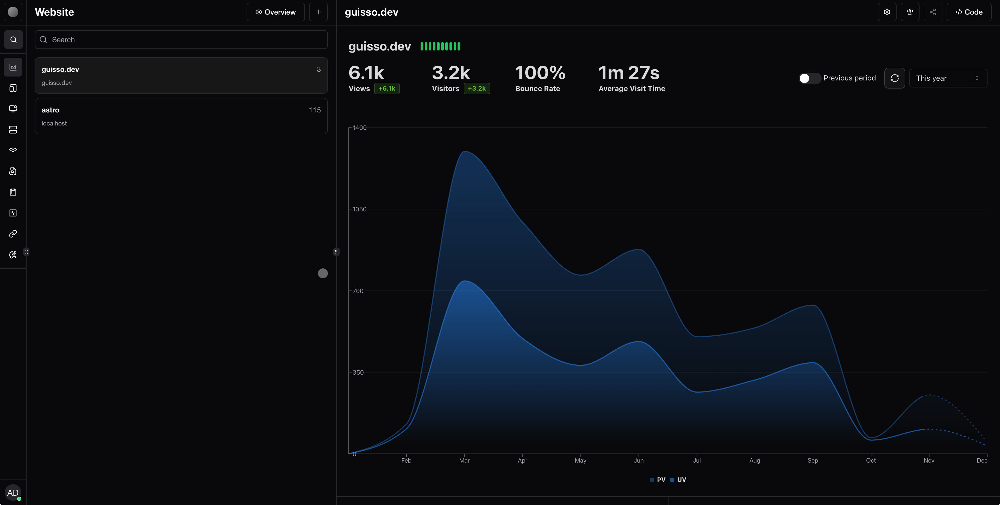
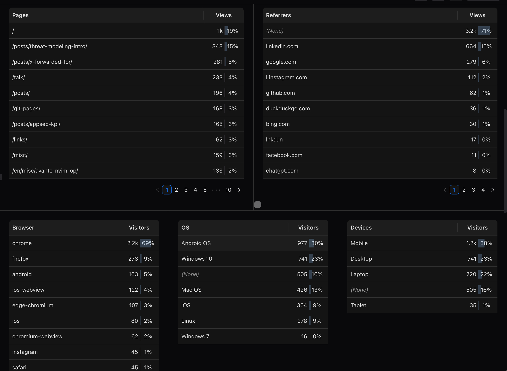
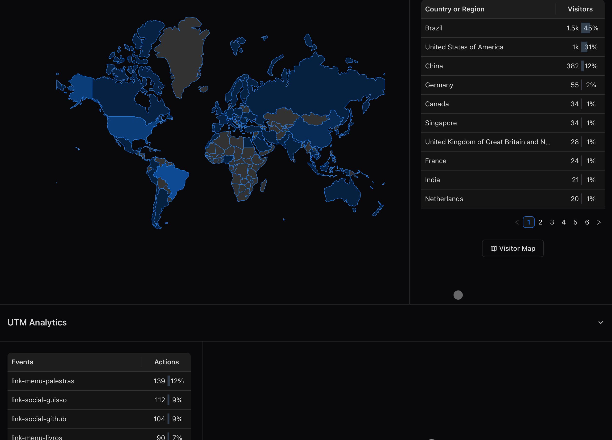
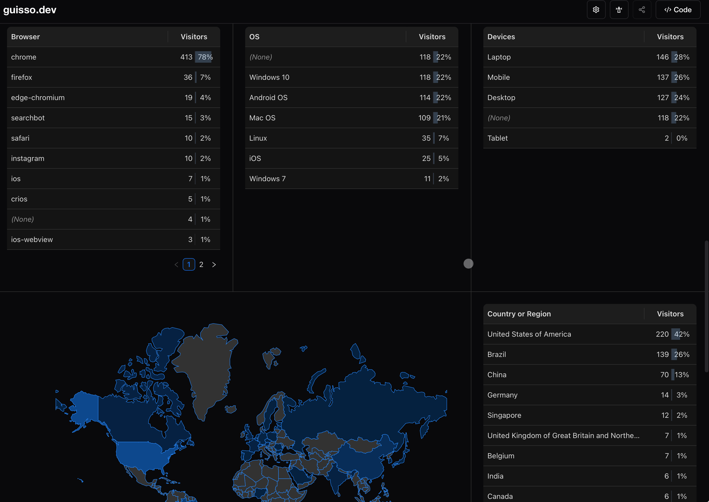

Desde o início de 2025 decidi experimentar o **Tianji**, uma plataforma de analytics open source com foco em privacidade. Em vez de contratar um serviço SaaS, optei por manter o Tianji rodando de forma autônoma em um mini-PC em casa. Essa decisão trouxe desafios - como o período recente em que, por conta de uma viagem, a máquina desligou e fiquei quase um mês sem coleta de dados - mas me permitiu um controle total sobre as métricas e a possibilidade de estudar a ferramenta a fundo.

O Tianji oferece um painel simples e poderoso. Para este ano, meu blog registrou **6,1 mil visualizações** e **3,2 mil visitantes**, com um tempo médio de visita de **1 minuto e 27 segundos**. O mais importante foi perceber que é possível coletar esses dados sem cookies invasivos: a plataforma utiliza apenas o fingerprint do navegador e armazena o mínimo necessário para construir gráficos de PV (page views) e UV (unique visitors). Além de contagem de páginas, implementei **actions** para rastrear cliques em botões de redes sociais e links externos, o que ajudou a entender quais conteúdos faziam os leitores saírem do site.

*Visão anual consolidada: PV, UV e tempo médio por sessão.*

## Estratégia de divulgação e picos de tráfego

No início do ano adotei uma estratégia simples de marketing: quebrei o artigo [Threat Modeling Intro](/blog/threat-modeling-intro) em pequenas seções e programei posts semanais no LinkedIn. Cada postagem apresentava um trecho do texto e terminava com um link para o artigo completo. Essa abordagem foi eficiente. O painel mostra que a série de posts gerou um grande pico de tráfego entre março e abril e fez do artigo sobre modelagem de ameaça o segundo conteúdo mais visitado do ano (cerca de **848 visualizações**).

Outros artigos com boa performance foram [X-Forwarded-For](/blog/x-forwarded-for), [Talk](/talk) e o artigo de KPIs de AppSec ([AppSec KPI](/blog/appsec-kpi)). Interessantemente, o artigo X-Forwarded-For não teve tantas divulgações no LinkedIn, mas ainda assim aparece entre os mais acessados. Isso sugere que há busca orgânica por esse tema ou que leitores que chegaram através de outro texto navegaram pelo blog.

*Paths mais visitados em 2025, com destaque para Threat Modeling e X-Forwarded-For.*

## Entendendo de onde vêm os visitantes

Os dados anuais mostraram que **45%** dos visitantes vieram do Brasil, **31%** dos Estados Unidos e **12%** da China. Esse panorama evidencia que a maior parte da audiência é nacional, algo que ficou mais claro depois que parei de divulgar artigos no LinkedIn e ainda assim continuei vendo acessos brasileiros crescerem. Curiosamente, ao filtrar os últimos 30 dias, o cenário muda: os Estados Unidos respondem por **30%** das visitas, seguidos por China (**20%**) e Brasil (**16%**). Esse dado reforça a importância de analisar diferentes períodos e mostra que a distribuição geográfica pode oscilar bastante quando deixamos de fazer campanhas pontuais.

Quanto às origens de tráfego, mais de **70%** das visitas foram diretas, mas o LinkedIn apareceu como principal referenciador externo ao longo do ano (**15%** das visitas). Nos últimos 30 dias, porém, o LinkedIn representou apenas um clique; os motores de busca - especialmente Google (**12%**), Bing e Kagi - passaram a ser a principal porta de entrada. Esse fenômeno é natural: sem posts na rede social, o blog depende mais de SEO e dos próprios leitores salvando o link para acessar depois.

*Mapa anual: Brasil lidera a audiência, seguido de EUA e China.*

## Analisando os últimos 90 dias e os meses individualmente

Ao observar um recorte maior - os últimos 90 dias - surgem nuances interessantes. Nesse período o site registrou **923 visualizações** e **522 visitantes**, com tempo médio de leitura de **1 minuto e 34 segundos**. A distribuição geográfica inverteu-se: os Estados Unidos concentraram **41%** dos visitantes, seguidos pelo Brasil (**26%**) e China (**13%**). O tráfego direto continuou majoritário (**77%**), mas Google e LinkedIn mantiveram uma presença significativa.

O gráfico de 90 dias ajuda a entender o que ocorreu mês a mês:

- **Setembro 2025:** mês com maior número de acessos no trimestre, com picos em torno de 23 de setembro, quando um artigo sobre cabeçalhos HTTP e outra atualização no blog tiveram bastante visualização. Nessa fase, as divulgações programadas no LinkedIn ainda estavam ativas e isso se refletiu nas 50 visitas vindas da rede.
- **Outubro 2025:** quase não houve visitas. O mini-PC que hospedava o Tianji ficou desligado durante boa parte do mês, o que explica a ausência de dados. Essa lacuna mostra a importância de ter um servidor dedicado ou redundâncias para evitar perda de métricas.
- **Novembro 2025:** após religar o servidor, o tráfego retornou gradualmente. No recorte de últimos 30 dias (que inclui parte de novembro e início de dezembro) o blog recebeu **286 visualizações** e **122 visitantes**, com aumento no tempo médio de leitura para **2 minutos e 29 segundos**. A maior parte dos visitantes chegou por busca orgânica; LinkedIn quase não contribuiu, já que parei as divulgações. As páginas mais acessadas nesse período foram a raiz `/`, [x-forwarded-for](/blog/x-forwarded-for) e um artigo sobre regras de CORS.

Também notei que, mesmo após reformular o design e mover todo o conteúdo antigo para uma nova URL (`guisso.dev/old-blog-2023`), o "blog velho" continuou recebendo acessos vindos de pesquisas. Isso reforça a importância de manter redirecionamentos corretos e monitorar separadamente o site principal e o legado; a divisão permitirá gerar ideias de conteúdo com base no que ainda desperta interesse nos artigos antigos.

*Recorte de 30 dias: PV, UV, tempo médio e mudança nos referenciadores.*

## Comportamento técnico e dispositivos

Analisando browsers, **Chrome** domina com **69%** dos visitantes no ano e **78%** nos últimos 30 dias. O acesso via mobile somou **38%** ao longo de 2025, enquanto laptops e desktops dividiram o restante. Isso revela a importância de manter o layout responsivo; embora eu não tenha feito otimizações específicas para dispositivos móveis, a experiência pareceu fluida, e acredito que parte da audiência do LinkedIn consome conteúdo pelo celular.

A distribuição de sistemas operacionais também variou: **Windows 10** e **Android** lideraram, mas Mac OS, Linux e iOS representaram fatias relevantes. Esses dados me ajudaram a validar se o site funcionava bem em diferentes plataformas, principalmente porque uso um tema gerado estático sem muitos testes cross-browser. O Tianji torna essas visualizações simples, permitindo entender se há problemas graves em algum ambiente.

## Lições aprendidas e próximos passos

Utilizar o Tianji de forma self-hosted me ensinou muito sobre infraestrutura. Precisei configurar atualizações automáticas, montar um backup para não perder dados e, principalmente, lidar com a interrupção inesperada quando o mini-PC desligou. A coleta contínua de métricas foi interrompida por quase um mês, o que impactou os relatórios, mas serviu de alerta para pensar em redundância.

Em relação ao conteúdo, ficou claro que consistência na divulgação é crucial. Enquanto mantive posts semanais no LinkedIn, os acessos dispararam; quando parei, a média diária caiu, mas parte do público continuou chegando por busca orgânica. Também percebi que tópicos técnicos de nicho - como headers HTTP e configurações de proxies - atraem visitas mesmo sem divulgação, sugerindo potencial para expandir séries sobre esses assuntos.
